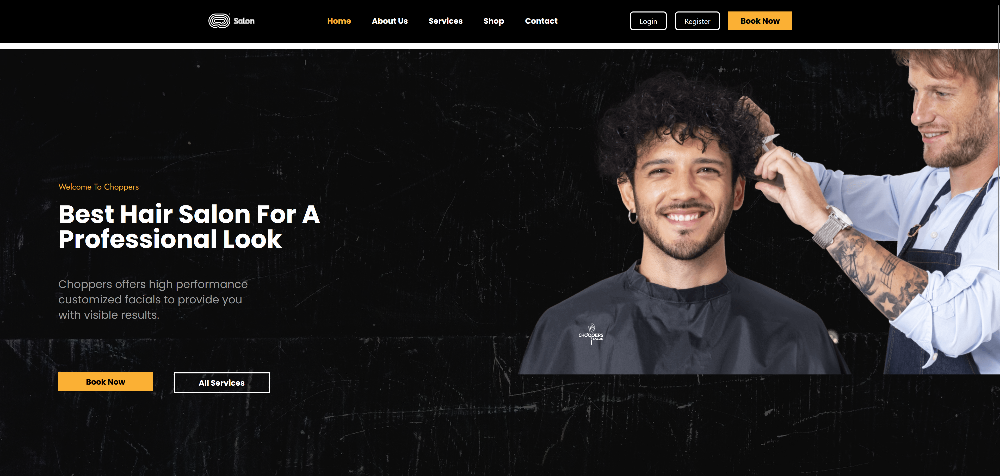
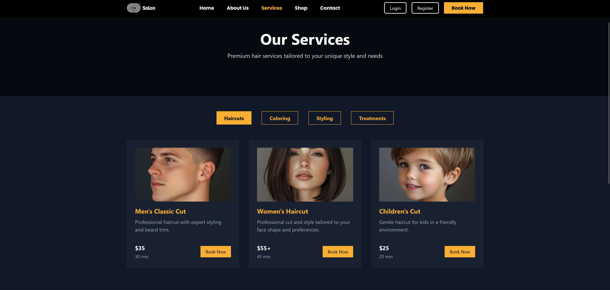
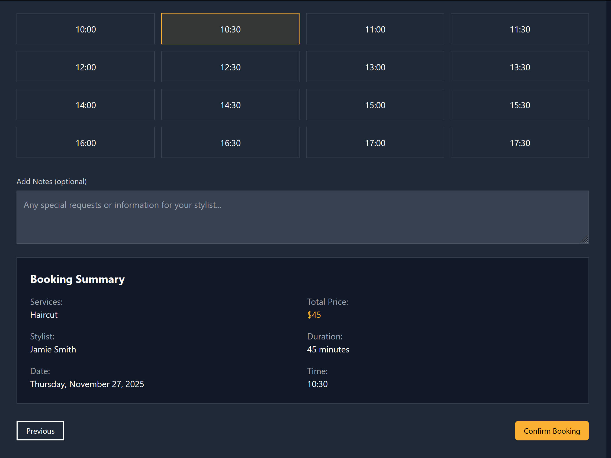
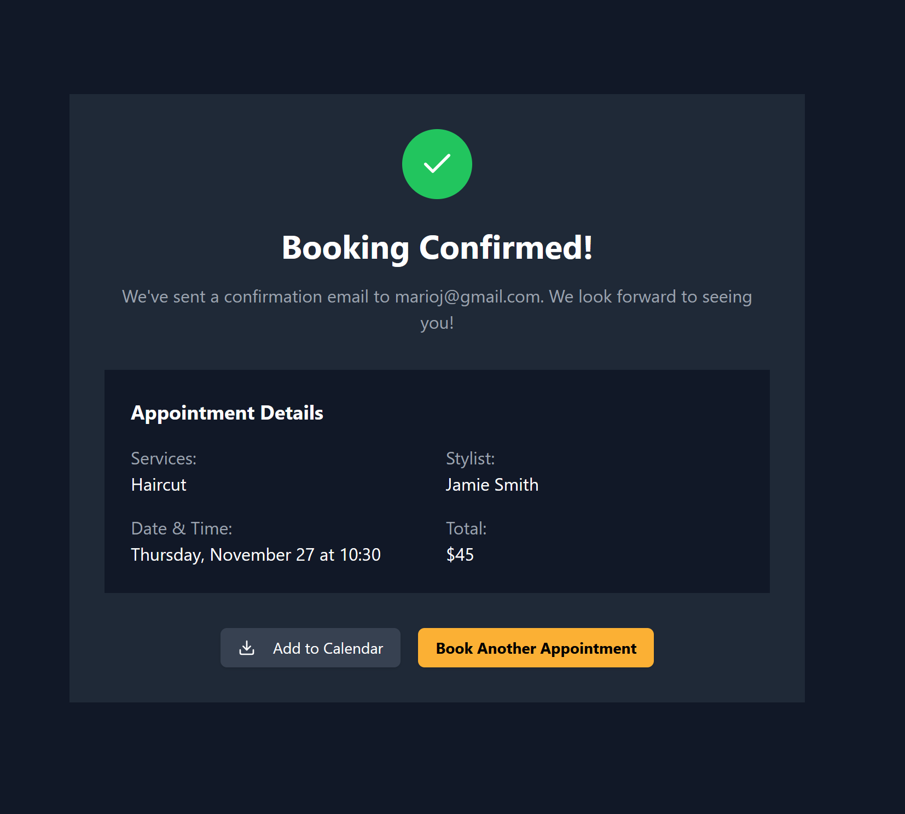
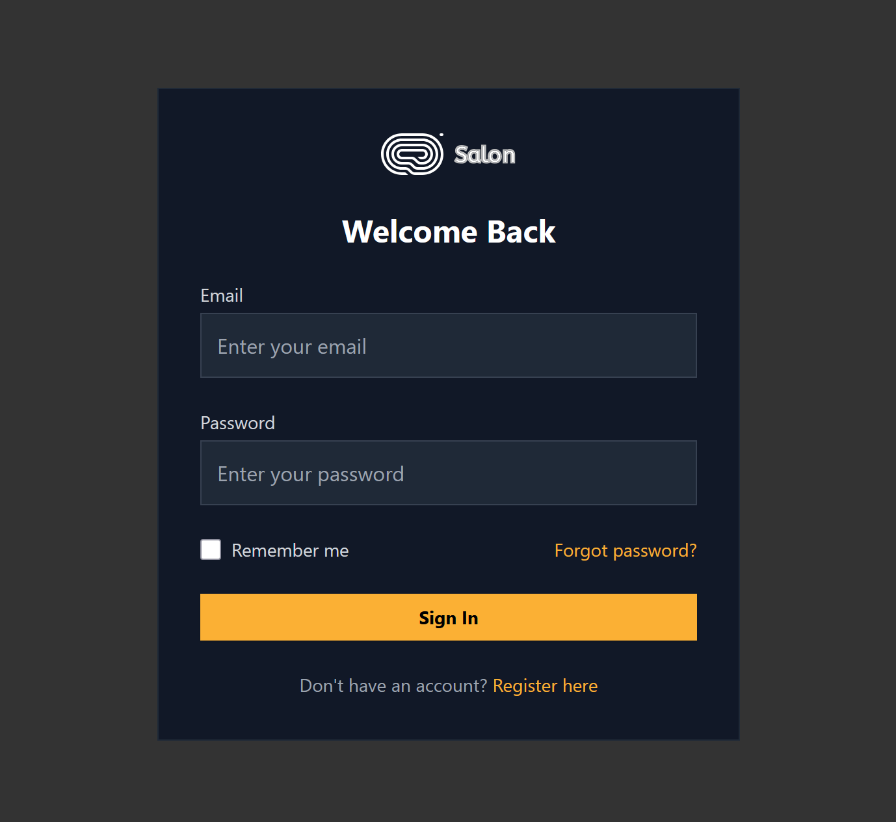
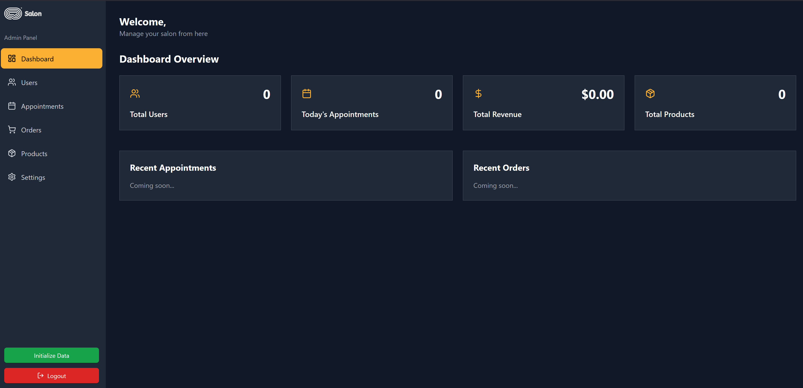
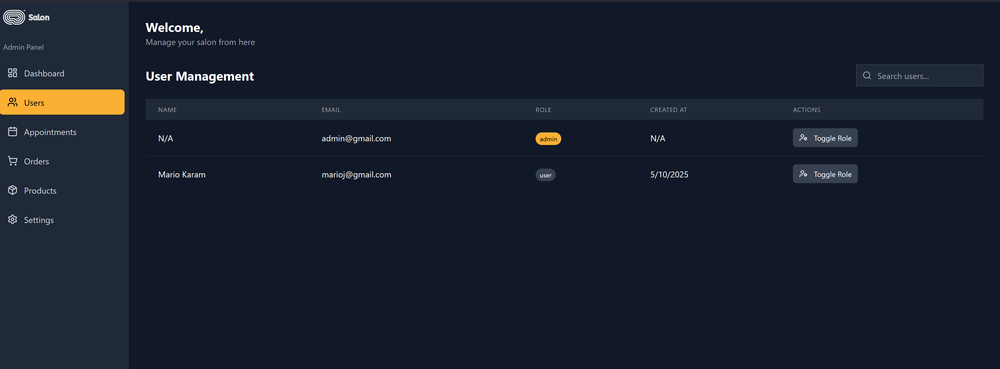
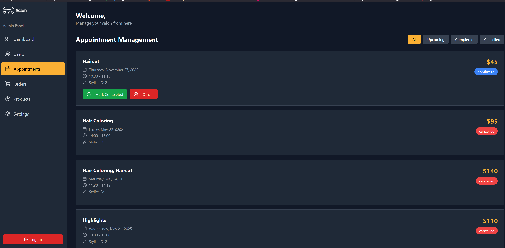

# Choppers Salon – Full-Stack Hair Salon Web App

Choppers Salon is a modern, full-stack hair-salon platform built with **React + TypeScript**, powered by **Vite**, styled with **Tailwind CSS**, and enhanced with **Shadcn UI** and **Radix UI**.  
The platform includes:

- A public marketing website  
- Services catalogue  
- Multi-step appointment booking  
- Authentication  
- Complete admin dashboard  

Data uses **Firebase Firestore**, authentication uses **Supabase**, and global state is managed with **Zustand**.

---

## ✨ Key Features

---

### 🌟 Landing Page
- Hero section with welcome text, tagline, and CTAs  
- “Book Now” → jumps directly into the booking flow  
- “All Services” → opens service catalogue  
- Fully responsive (desktop, tablet, mobile)

---

### 💇‍♀️ Services Catalogue
- Organized categories: Haircuts, Coloring, Styling, Treatments  
- Dynamic, tabbed interface  
- Each card includes:
  - Name  
  - Description  
  - Price  
  - Duration  
  - “Book Now” button  
- All services fully managed via Firestore or the admin dashboard

---

### 📆 Appointment Booking (Protected Route)
A guided multi-step flow:

1. Select Service  
2. Choose Stylist  
3. Select Date  
4. Select Time  
5. Confirm Booking  

Additional features:
- Pulls live data from Firestore  
- Users can view, manage, and cancel existing appointments  

---

### 🔐 Authentication & Protected Routes
- Built with **Supabase Auth**  
- Password hashing via `bcryptjs`  
- Booking pages and Admin Dashboard require authentication  
- ProtectedRoute wrapper ensures route security  

---

### 🛒 Shop (Coming Soon)
- Placeholder for e-commerce functionality  
- Designed to later sell hair products & accessories  

---

### 🧑‍💼 Admin Dashboard
Accessible at `/admin`, includes:

#### ✔️ Overview
- Total Users  
- Today’s Appointments  
- Revenue  
- Total Products  

#### ✔️ Users Management
- Search  
- View user details  
- Toggle role: user ↔ admin  

#### ✔️ Appointments Management
- List all appointments  
- Filter by: All, Upcoming, Completed, Cancelled  
- Mark appointment status  

#### ✔️ Products & Orders
- Placeholder pages ready for future e-commerce integration  

#### ✔️ Settings
- Salon hours  
- Contact details  
- Salon metadata  

---

### 📱 Responsive + Dark Mode
- Fully responsive pages  
- Light and dark themes  
- Consistent branding using Tailwind + custom classes  

---

### 📧 Email Templates
`emailTemplates.ts` includes:
- Booking confirmation HTML email  
- Password reset template  

---

## 🧰 Tech Stack

### Frontend  
React 18, TypeScript, Vite, React Router v7, Zustand, React Hook Form, Zod

### Styling  
Tailwind CSS, Shadcn UI, Radix UI, Poppins, Jost

### Backend / Data  
Firebase Firestore, Supabase Authentication

### Utilities  
Lucide React, Lodash, Class-variance-authority (cva)

---

## 📂 Project Structure

```
ChoppersSalon/
├─ public/                 # Static assets (images, icons, fonts)
├─ src/
│  ├─ components/          # Shared components (Navbar, Footer, ProtectedRoute)
│  ├─ config/              # Firebase & Supabase setup
│  ├─ routes/
│  │   └─ router.tsx       # Route definitions
│  ├─ screens/
│  │   ├─ Home.tsx         # Landing page
│  │   ├─ Services.tsx     # Services catalogue
│  │   ├─ booking/         # Multi-step booking flow
│  │   ├─ admin/           # Dashboard: Overview, Users, Appointments, etc.
│  │   ├─ Auth/            # Login / Register
│  │   ├─ Contact.tsx      # Contact page
│  │   └─ About.tsx        # About page
│  ├─ store/               # Zustand stores
│  ├─ utils/               # Helper functions
│  └─ App.tsx              # Root component
├─ tailwind.config.js
├─ package.json
└─ README.md
```

---

## 📸 Screenshots

### 🏠 Homepage  


### 💈 Services  


### 🗓️ Booking Flow  
**Step 1 – Choose Service**  


**Step 2 – Choose Time**  


**Step 3 – Confirmation**  


### 🔐 Admin Login  


### 📊 Admin Dashboard  


### 👤 User Management  


### 📅 Appointments Management  


---

## 🚀 Getting Started

### 1. Clone the Repository
```bash
git clone https://github.com/mariok56/ChoppersSalon.git
cd ChoppersSalon
```

### 2. Install Dependencies
```bash
npm install
```

### 3. Configure Environment Variables  
Create `.env` with:

```
VITE_SUPABASE_URL=
VITE_SUPABASE_ANON_KEY=

VITE_FIREBASE_API_KEY=
VITE_FIREBASE_AUTH_DOMAIN=
VITE_FIREBASE_PROJECT_ID=
VITE_FIREBASE_STORAGE_BUCKET=
VITE_FIREBASE_MESSAGING_SENDER_ID=
VITE_FIREBASE_APP_ID=
```

### 4. Run Development Server
```bash
npm run dev
```

Visit:  
http://localhost:5173

### 5. Build for Production
```bash
npm run build
```

---

## 🧑‍💻 Contributing

1. Fork the repo  
2. Create a new branch  
3. Commit with clear messages  
4. Open a pull request  

---

## 📄 License

This project is for educational & portfolio purposes.  
If you want to use it in production, please contact the author.
